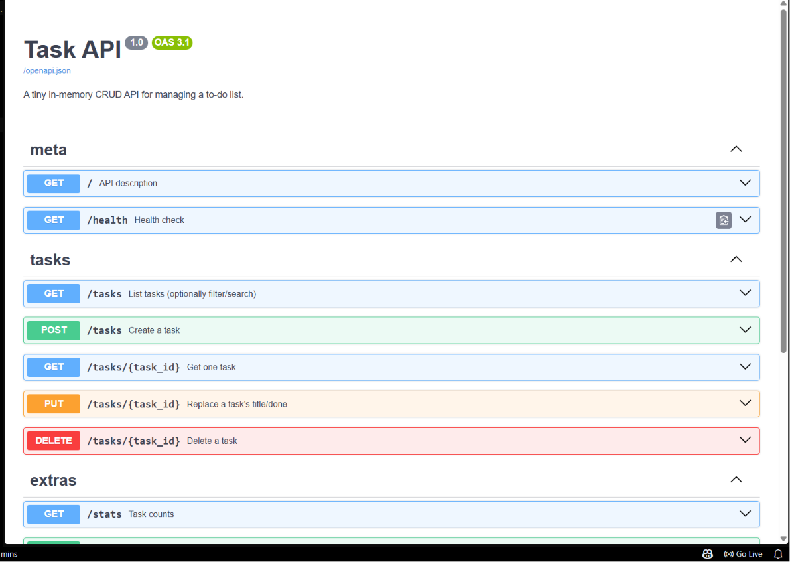

# Task API

A small in-memory CRUD API for managing a to-do list — built with **FastAPI** for the FlyRank Internship, Backend Track, W2 · A1.

Create, read, update, and delete tasks. Data lives only in memory (a Python list) — restarting the server resets it back to the 3 seed tasks. That's expected: there's no database yet (that's next week).

## Run it

One documented command:

```bash
pip install -r requirements.txt
uvicorn main:app --reload
```

The server starts on **http://localhost:8000**. Interactive Swagger docs are automatically available at **http://localhost:8000/docs** — no setup needed, FastAPI generates them from the code.

## Endpoints

| Method | Path | What it does | Success | Errors |
|---|---|---|---|---|
| GET | `/` | API description | 200 | — |
| GET | `/health` | Health check | 200 | — |
| GET | `/tasks` | List all tasks (supports `?done=true/false` and `?search=text`) | 200 | — |
| GET | `/tasks/{id}` | Get one task | 200 | 404 if unknown id |
| POST | `/tasks` | Create a task (`{"title": "..."}`) | 201 | 400 if title missing/empty |
| PUT | `/tasks/{id}` | Update a task's title and/or done flag | 200 | 404 unknown id, 400 empty body/title |
| DELETE | `/tasks/{id}` | Delete a task | 204 | 404 if unknown id |
| GET | `/stats` | `{"total", "done", "open"}` counts | 200 | — |
| POST | `/reset` | Restore the 3 seed tasks | 200 | — |

Every error response is shaped `{"error": "..."}` — FastAPI's default validation error (422, `{"detail": [...]}`) is overridden with a custom exception handler so bad input consistently returns `400` with a plain `error` message, matching the assignment spec.

## Example: full CRUD cycle via curl

```
$ curl -i http://localhost:8000/
HTTP/1.1 200 OK
content-type: application/json

{"name":"Task API","version":"1.0","endpoints":["/tasks"]}

$ curl -i http://localhost:8000/tasks/1
HTTP/1.1 200 OK
content-type: application/json

{"id":1,"title":"Buy milk","done":false}

$ curl -i http://localhost:8000/tasks/99
HTTP/1.1 404 Not Found
content-type: application/json

{"error":"Task 99 not found"}

$ curl -i -X POST http://localhost:8000/tasks -H "Content-Type: application/json" -d '{"title":"Buy milk"}'
HTTP/1.1 201 Created
content-type: application/json

{"id":4,"title":"Buy milk","done":false}

$ curl -i -X POST http://localhost:8000/tasks -H "Content-Type: application/json" -d '{}'
HTTP/1.1 400 Bad Request
content-type: application/json

{"error":"Invalid value for 'title': Field required"}

$ curl -i -X PUT http://localhost:8000/tasks/1 -H "Content-Type: application/json" -d '{"done": true}'
HTTP/1.1 200 OK
content-type: application/json

{"id":1,"title":"Buy milk","done":true}

$ curl -i -X DELETE http://localhost:8000/tasks/1
HTTP/1.1 204 No Content
```

All of the above was run against this exact code before submission — status codes and bodies are copy-pasted from a real local run, not written from memory.

## Swagger UI



*(Screenshot placeholder — open http://localhost:8000/docs, run through the CRUD cycle with "Try it out", and drop your own screenshot at `docs/swagger-screenshot.png` before submitting. This has to be a real screenshot from your machine.)*

## Extras built

- **Filtering**: `GET /tasks?done=true`
- **Search**: `GET /tasks?search=milk`
- **Stats**: `GET /stats`
- **Seed & reset**: `POST /reset`

### The mortality experiment

Create a task, restart the server (`Ctrl+C` then `uvicorn main:app --reload` again), then `GET /tasks`. The task you created is gone — the list resets to the 3 seed tasks on every restart. That's because `tasks` is a plain Python list living in the process's memory; nothing writes it to disk, so when the process ends, so does the data. This is exactly the gap a real database fills, which is why it's next on the syllabus.

## Project structure

```
todo-api/
├── main.py           # the whole API
├── requirements.txt
├── README.md
└── .gitignore
```

## What's left for you to do before submitting

This code was generated to match every checkpoint in the assignment brief and has been tested end-to-end (see the curl output above, run for real against this code). But a few things only you can do:

1. **Take the actual Swagger screenshot** from your own browser at `/docs` and drop it in `docs/swagger-screenshot.png`.
2. **Push it to GitHub yourself** with one commit per stage (`git init`, then commit as you review/understand each stage) — the assignment specifically wants "≥6 meaningful commits, honestly earned." A single bulk commit from a downloaded zip won't read as that.
3. **Read through `main.py`** before you submit it — you should be able to explain every line, since that's the actual point of the exercise (and it's exactly what Stage 7's "AI vs me" bonus stage is testing for).
4. **Stage 7 (bonus)** is designed to happen *after* you've built this by hand and understand it — write your own from-memory prompt, generate a second version in `ai-version/`, and diff it against this one. Since this code was itself AI-generated, doing that comparison honestly means building your own version first, independently, then comparing.
